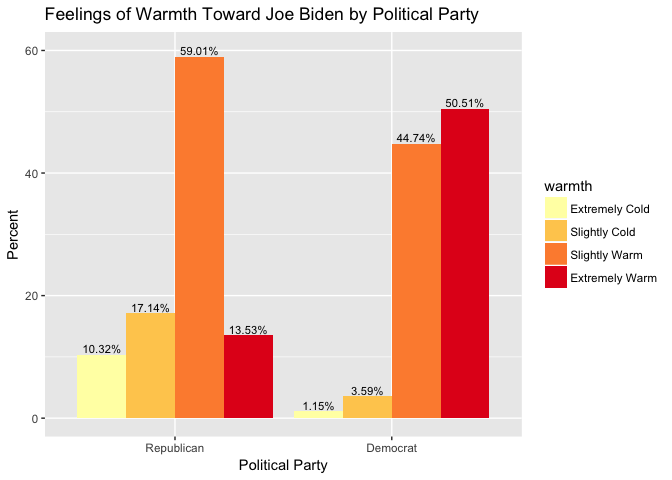

DataViz-A1
================
Dana Westley
Due 4/10/2017

Part 1: Visualization critique (5 points)
=========================================

The visualization I chose was created by John Nelson using data from a partnership between the National Drought Mitigation Center at the University of Nebraska-Lincoln, the USDA, and NOAA studying the duration and severity of droughts in the continental U.S. Here is the link to the map. (<https://adventuresinmapping.com/2016/07/12/five-years-of-drought/>) I will be discussing the very first image that appears on the page, "Five+Years of Drought"

Is it truthful?
---------------

Considering the sources of the data, we can be pretty confident that the dataset is, at least, accurate. When it comes to the truthfulness of the visualization, as we discussed in class, I would also say that it meets our criteria. It uses a map of the U.S. to plot geographic data. It also uses two channels that we as human beings are pretty good at distinguishing: color and size. The color represents the intensity of the drought, getting darker with severity, and the size correlates with the duration of drought in the area, with larger points identifying long-lasting droughts. The image is not misleading and conveys the information it is meant to.

Is it functional?
-----------------

The purpose of this map is to show which areas of the country experience drought, how intense the drought is in that area, and the typical duration of drought. Conveying all of this informaiton in one image is not easy, and based on the methods Nelson chose, we can easily see which areas experience the worst & longest-lasting drought. This visuyalization conveys the information it is meant to and tells a story about the areas most affected by drought in this country.

Is it beautiful?
----------------

This image is definitely beautiful. It is not cluttered, and uses 2 channels of size and color layered over a map of the U.S. It also contains text that denotes statistics about the drought conditions in certain areas to further convey it's message. It uses an intuitive color palette and seemingly simple size variation for the points. All of this creates an image that is nice to look at while clearly conveying its message.

Is it insightful?
-----------------

As Cairo suggests, we benefit from seeing this data represented visually because it conveys information quickly and simply that would not be as easily seen in a table, or surmized from reading a summary of the data. Also, Nelson takes over five years of information and condenses it down into a single straight-forward image. We can easily see which areas of the U.S. have the worst kinds of drought (dark purple) or the longest lasting droughts (large points). Yes, this is an insightful visualization.

Is it enlightening?
-------------------

Droughts in the U.S. I believe, are getting more severe and longer-lasting than in the past. I think this visualization is fairly enlightening on its own, but it only includes data from the past 5 years. If this visualization was compared side by side with one depicting drought data from 20, 30, or 40 years ago, then I could imagine more use for it in policy, journalism, or popular education in order to "do good with data".

Part 2: `ggplot2` and the grammar of graphics (10 points)
=========================================================

My visualization:

    ## 
    ## Attaching package: 'dplyr'

    ## The following objects are masked from 'package:stats':
    ## 
    ##     filter, lag

    ## The following objects are masked from 'package:base':
    ## 
    ##     intersect, setdiff, setequal, union

I found the way to scale to percetages from (<http://stackoverflow.com/questions/3695497/show-instead-of-counts-in-charts-of-categorical-variables>)

fixing percentages by group and adding percent labels found here: (<http://stackoverflow.com/revisions/40250493/2>)

I also used the ggplot R-Studio cheat sheet from (<https://www.rstudio.com/wp-content/uploads/2016/11/ggplot2-cheatsheet-2.1.pdf>)

color palette chosen here: (<http://www.sthda.com/english/wiki/ggplot2-colors-how-to-change-colors-automatically-and-manually#use-rcolorbrewer-palettes>)
