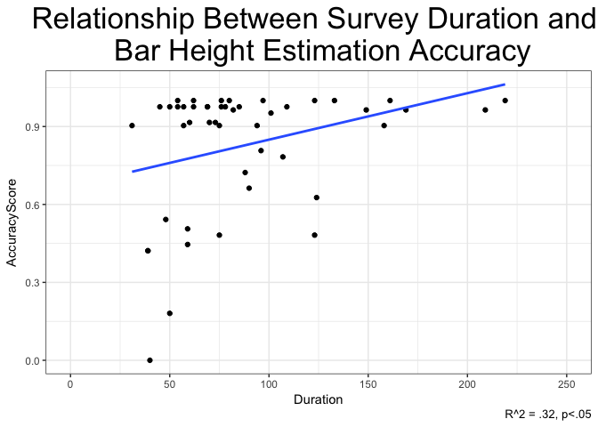

Assignment 2
================
Dana Westley
Due April 28


Double-Encoding Visual Information Appears to Reduce Accuracy of Perception
===========================================================================

Research Question
-----------------

I wondered if providing more information, i.e. using a second channel to encode information in a visualizaiton, would improve or hinder the processing of information. My original hypothesis was that using a second channel would help people to accurately process the information in the visual more easily and quickly. My thinking was that with two layers of information However, those in the Tufte school of thought may consider this to be superfluous, or unnecessary "noise" that wouldactually hinder people's processing of the information conveyed.

In order to test this idea, I created a simple bar graph since perceptually, we are extremely accurate at comparing height of lines from a common base line. I used the mpg dataset to create a count of each type of car in the dataset. However, the information was presented as "percent of Americans who own each type of car" for a realistic feel. One version of the graph had bars of all one color, making up the control condition. For the test condition, the bars in the graph varied on a color gradient, getting darker as their height got longer. For the control group, the information was only conveyed in one channel: bar height. For the test group, the information was encoded via two channels: bar height *and* color gradient.

The Survey - Methodology
------------------------

Participants were informed that this survey was for class purposes only and that it should take no more than 2-3 minutes. Age, Race, and Gender was collected for each particpant. A total of 52 people responded to the survey. 5 were eliminated from statistical analyses for not answering, or answering in non-numeric fashion when asked to estimate the difference between two bar heights. For example

The survey can be found here: (<http://ssd.az1.qualtrics.com/jfe/form/SV_9WXJPrZegpU2FmZ>)

Results
-------

``` r
density_group
```

    ## Warning: Removed 5 rows containing non-finite values (stat_density).


``` r
cor_plot
```

    ## Warning: Removed 5 rows containing non-finite values (stat_smooth).

    ## Warning: Removed 5 rows containing missing values (geom_point).



``` r
log_reg
```


Conclusion
----------
