Analysis
================
Soo Wan Kim
April 28, 2017

The Role of Color in Proportional Judgment in Bar Charts
========================================================

Introduction
------------

This study uses experimental data drawn from the Amazon Mechanical Turk crowdsourcing platform to address the question: "How does color affect proportional judgment in bar charts?"

I tested the following hypotheses:

-   H1: The color of bars has no effect on proportional judgment.
-   H2: Color in bar charts serves primarily to attract and hold attention, which improves judgment of proportion by improving attentiveness. Thus, proportional judgment should be improved in colored bar charts relative to bar charts without color, but selective or indiscriminate use of color should not matter as much.
-   H3: Selectively applying color to the relevant parts of the chart facilitates focus on relevant information and leads to better judgments of proportion, more so than if color were applied indiscriminately.

Using means comparisons, I find significant support for the argument that selectively applying color helps focus attention to the relevant parts of a chart and thus faciliates proportional judgments in bar charts. I find weaker support for the argument that selective use of color aids prportional judgment more so than indiscriminate coloring. However, flaws in the experimental design preclude strong arguments in support of either finding.

Data
----

As in Heer and Bostock's 2010 study, the experiment sample were recruited from Amazon Mechanical Turk (MTurk). Across all treatment groups, the task was to pick out the shorter of two bars or bar segments within a bar chart and estimate the percentage of the height of the taller bar that the height of the shorter bar made up. The bar charts were designed based on Cleveland and McGill (1984)'s proportional judgments experiment and Heer and Bostock (2010)'s replication of the same. There were two types: stacked or segmented bar charts with two bars each where the bars each had four segments representing different sub-groups, and non-stacked bar charts with four bars each where the bars were not segmented.

There were three treatment groups: in treatment 1, participants viewed only black and white bar charts, in treament 2, participants looked at bar charts where all bars had a different color, and in treatment 3, participants looked at bar charts where only the relevant bars or segments were colored and the rest of the chart was black and white. Aside from the coloring, the plots were identical across treatments. The instructions and prompts were also the same. The plots and questions used for the study can be viewed in the "Experimental Design" folder.

The experiment was conducted via online survey using Qualtrics. The treatments were administered by means of three independent surveys, linked from three separate HITs on MTurk. Each treatment group included about 70 individuals for a total of 215 participants. However, 29.77% of the data was unusable, leaving observations from 151 unique participants with around 50 individuals in each treatment group. Each survey included one screening question and five proprortional judgment questions, including two non-stacked bar charts and three stacked bar charts. Thus, excluding the screening question the final data set included 151 x 5 or 755 observations.

The screening question asked the participant to pick out the bar representing the lowest value from among four bars. It was somewhat of a trick question, however, since two of the bars were marked from the rest, as if asking the participant to compare between the two bars only. Slightly more than half of respondents either answered correctly with the lowest bar out of the four or incorrectly with the lower bar out of the two marked bars. The responses with the latter answer to the screening question were not filtered out provided that the rest of the answers were appropriate, i.e. numeric responses indicating percentages. All responses where the participants provided letters representing the bars rather than percentages were discarded.

Feedback from some initially rejected workers suggested that the wording of the questions was problematic. For example, a few workers expressed that they wrote down the estimaged percentage of the height of the taller bar relative to the shorter bar, mistakenly believing this to be the required response. Thus, I retained responses where percentages were larger than 100 and converted them to the appropriate form by taking the inverse and multiplying by 10,000.

<table>
<caption>
Number of observations per treatment group, collected and used
</caption>
<thead>
<tr>
<th style="text-align:left;">
Treatment Group
</th>
<th style="text-align:right;">
Collected
</th>
<th style="text-align:right;">
Used
</th>
</tr>
</thead>
<tbody>
<tr>
<td style="text-align:left;">
1
</td>
<td style="text-align:right;">
70
</td>
<td style="text-align:right;">
51
</td>
</tr>
<tr>
<td style="text-align:left;">
2
</td>
<td style="text-align:right;">
73
</td>
<td style="text-align:right;">
50
</td>
</tr>
<tr>
<td style="text-align:left;">
3
</td>
<td style="text-align:right;">
72
</td>
<td style="text-align:right;">
50
</td>
</tr>
<tr>
<td style="text-align:left;">
All
</td>
<td style="text-align:right;">
215
</td>
<td style="text-align:right;">
151
</td>
</tr>
</tbody>
</table>
All three tasks were released on MTurk around 2 AM on the same day. However, due to discrepancies in the time periods where I checked, rejected and re-released submissions, each task covered somewhat different time periods between roughly 3 AM and 9 AM. In particular, more of task 2 was completed later in the morning relative to task 1 and task 3 was completed later than the other two tasks. This could have affected the results, particularly since workers from English-speaking countries are more likely to be awake later in the morning.

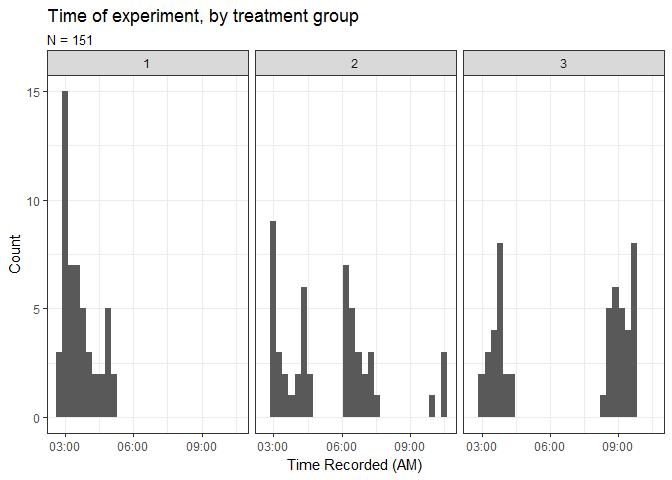

Based on geolocations data from Qualtrics, it appears most of the workers reside in the US or India. There were somewhat more workers from the US and UK in treatment group 3 compared to the other treatment groups, as the above timelines would suggest.

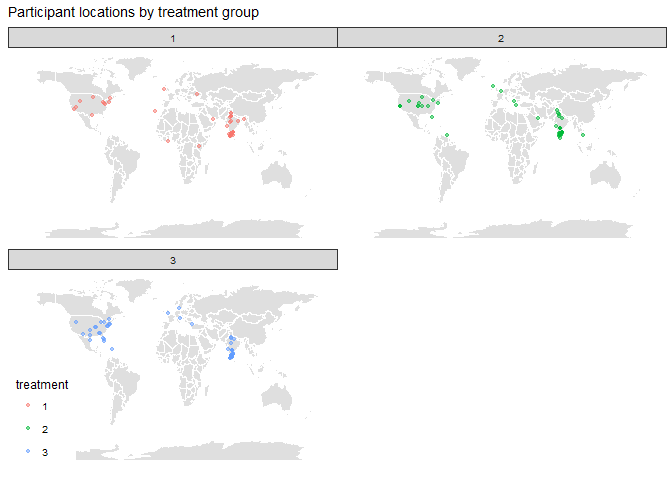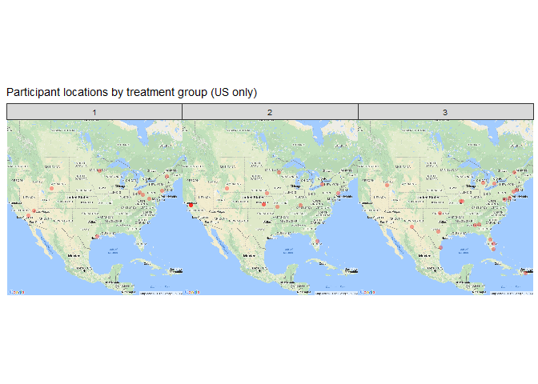

The average time to complete each HIT was 183.6291391, or about 3 minutes.

<table>
<caption>
Time taken to complete experiment
</caption>
<thead>
<tr>
<th style="text-align:left;">
Treatment Group
</th>
<th style="text-align:left;">
Time (seconds)
</th>
</tr>
</thead>
<tbody>
<tr>
<td style="text-align:left;">
1
</td>
<td style="text-align:left;">
199.73
</td>
</tr>
<tr>
<td style="text-align:left;">
2
</td>
<td style="text-align:left;">
162.24
</td>
</tr>
<tr>
<td style="text-align:left;">
3
</td>
<td style="text-align:left;">
188.6
</td>
</tr>
<tr>
<td style="text-align:left;">
All
</td>
<td style="text-align:left;">
183.63
</td>
</tr>
</tbody>
</table>
### Note on ethics:

All initially rejected workers were approved and paid, considering that I did use their responses for analysis, even if only to analyze the rate of successful completion. All personally identifiable information such as IP Address and MTurk Worker ID were removed from the data. Geolocation data was included only to analyze the geographical spread of the participants.

Results
-------

The following table shows the mean of the absolute value of the error for all five questions by treatment group. Treatment group 3 or the group shown selectively colored bar charts performed the best, lending support to hypothesis 3. However, it appears the type of question may also have played an important role in the overall results. Participants performed much better in questions 2 and 3, the questions involving non-stacked bar charts, compared to the rest of the questions which involved stacked or segmented bar charts, in which performance was quite poor across the board. This suggests either that the segmenting induced confusion with the added difficulty of addressing the relative positioning on top of relative height, or simply induced confusion. It is possible that some workers did not properly understand the question and compared the heights of the whole bars rather than the segments.

<table>
<caption>
Mean absolute error across questions
</caption>
<thead>
<tr>
<th style="text-align:left;">
Treatment Group
</th>
<th style="text-align:right;">
Q2
</th>
<th style="text-align:right;">
Q4
</th>
<th style="text-align:right;">
Q3
</th>
<th style="text-align:right;">
Q5
</th>
<th style="text-align:right;">
Q6
</th>
<th style="text-align:right;">
All Questions
</th>
</tr>
</thead>
<tbody>
<tr>
<td style="text-align:left;">
1
</td>
<td style="text-align:right;">
18.01
</td>
<td style="text-align:right;">
8.79
</td>
<td style="text-align:right;">
23.55
</td>
<td style="text-align:right;">
37.21
</td>
<td style="text-align:right;">
24.64
</td>
<td style="text-align:right;">
112.20
</td>
</tr>
<tr>
<td style="text-align:left;">
2
</td>
<td style="text-align:right;">
18.42
</td>
<td style="text-align:right;">
9.30
</td>
<td style="text-align:right;">
33.17
</td>
<td style="text-align:right;">
30.84
</td>
<td style="text-align:right;">
24.75
</td>
<td style="text-align:right;">
116.48
</td>
</tr>
<tr>
<td style="text-align:left;">
3
</td>
<td style="text-align:right;">
13.41
</td>
<td style="text-align:right;">
6.92
</td>
<td style="text-align:right;">
10.30
</td>
<td style="text-align:right;">
23.66
</td>
<td style="text-align:right;">
20.11
</td>
<td style="text-align:right;">
74.39
</td>
</tr>
<tr>
<td style="text-align:left;">
All
</td>
<td style="text-align:right;">
16.62
</td>
<td style="text-align:right;">
8.34
</td>
<td style="text-align:right;">
22.35
</td>
<td style="text-align:right;">
30.61
</td>
<td style="text-align:right;">
23.18
</td>
<td style="text-align:right;">
101.10
</td>
</tr>
</tbody>
</table>
The amount of time taken to complete the task does not appear to have had a signficant effect on performance, as the graph below demonstrates.

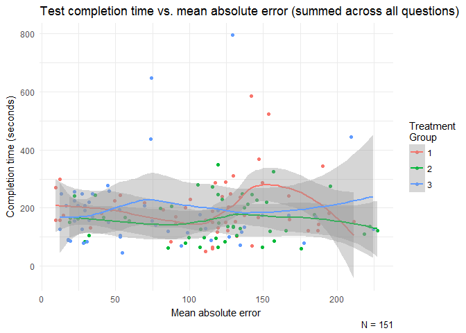

To test the hypotheses further, I use visualizations and the Wilcoxon-Mann-Whitney rank sum test for comparing means without assuming a normal distribution. The two graphs below show the distributions of absolute error averaged across all questions for each of the treatment groups. The first graph uses all observations, while the second uses all observations collected before 4 AM. Controlling for time should indirectly control for worker location.

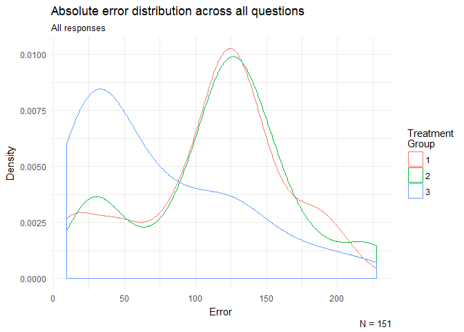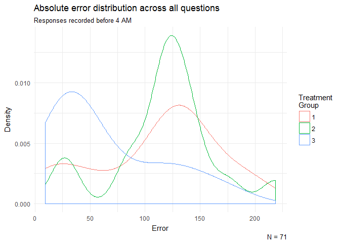

The following chart shows the results from applying the Wilconox test on all combinations of treatment groups for all questions. The results indicate that there is not a significant difference in mean error between treatment groups 1 and 2 for all questions, suggesting that indiscrimately coloring all bars does not significantly aid proportional judgment relative to black and white charts for either stacked or non-stacked bar charts. However, in most cases we find a significant difference in means between groups 1 and 3. This suggests that selective coloring improves proportional judgment relative to no coloring. Also, when comparing differences in the means of absolute error for all questions combined, we see that there is a signficant difference between groups 2 and 3. This lends weak support to the argument that selective coloring aids proportional judgment more so than indiscriminate coloring.

<table>
<caption>
Wilcoxon two-sided rank sum test with continuity correction
</caption>
<thead>
<tr>
<th style="text-align:left;">
Question
</th>
<th style="text-align:left;">
Groups Compared
</th>
<th style="text-align:right;">
Statistic
</th>
<th style="text-align:right;">
P-Value
</th>
<th style="text-align:left;">
Significant
</th>
</tr>
</thead>
<tbody>
<tr>
<td style="text-align:left;">
2
</td>
<td style="text-align:left;">
1 & 2
</td>
<td style="text-align:right;">
1332.5
</td>
<td style="text-align:right;">
0.6955000
</td>
<td style="text-align:left;">
</td>
</tr>
<tr>
<td style="text-align:left;">
2
</td>
<td style="text-align:left;">
1 & 3
</td>
<td style="text-align:right;">
1413.5
</td>
<td style="text-align:right;">
0.3341060
</td>
<td style="text-align:left;">
</td>
</tr>
<tr>
<td style="text-align:left;">
2
</td>
<td style="text-align:left;">
2 & 3
</td>
<td style="text-align:right;">
1337.0
</td>
<td style="text-align:right;">
0.5422005
</td>
<td style="text-align:left;">
</td>
</tr>
<tr>
<td style="text-align:left;">
3
</td>
<td style="text-align:left;">
1 & 2
</td>
<td style="text-align:right;">
1471.0
</td>
<td style="text-align:right;">
0.1800314
</td>
<td style="text-align:left;">
</td>
</tr>
<tr>
<td style="text-align:left;">
3
</td>
<td style="text-align:left;">
1 & 3
</td>
<td style="text-align:right;">
901.5
</td>
<td style="text-align:right;">
0.0104830
</td>
<td style="text-align:left;">
-   </td>
    </tr>
    <tr>
    <td style="text-align:left;">
    3
    </td>
    <td style="text-align:left;">
    2 & 3
    </td>
    <td style="text-align:right;">
    737.5
    </td>
    <td style="text-align:right;">
    0.0003632
    </td>
    <td style="text-align:left;">
    -   </td>
        </tr>
        <tr>
        <td style="text-align:left;">
        4
        </td>
        <td style="text-align:left;">
        1 & 2
        </td>
        <td style="text-align:right;">
        1304.0
        </td>
        <td style="text-align:right;">
        0.8333424
        </td>
        <td style="text-align:left;">
        </td>
        </tr>
        <tr>
        <td style="text-align:left;">
        4
        </td>
        <td style="text-align:left;">
        1 & 3
        </td>
        <td style="text-align:right;">
        1341.0
        </td>
        <td style="text-align:right;">
        0.6117612
        </td>
        <td style="text-align:left;">
        </td>
        </tr>
        <tr>
        <td style="text-align:left;">
        4
        </td>
        <td style="text-align:left;">
        2 & 3
        </td>
        <td style="text-align:right;">
        1297.5
        </td>
        <td style="text-align:right;">
        0.7209780
        </td>
        <td style="text-align:left;">
        </td>
        </tr>
        <tr>
        <td style="text-align:left;">
        5
        </td>
        <td style="text-align:left;">
        1 & 2
        </td>
        <td style="text-align:right;">
        1472.0
        </td>
        <td style="text-align:right;">
        0.1802301
        </td>
        <td style="text-align:left;">
        </td>
        </tr>
        <tr>
        <td style="text-align:left;">
        5
        </td>
        <td style="text-align:left;">
        1 & 3
        </td>
        <td style="text-align:right;">
        1640.5
        </td>
        <td style="text-align:right;">
        0.0126102
        </td>
        <td style="text-align:left;">
        -   </td>
            </tr>
            <tr>
            <td style="text-align:left;">
            5
            </td>
            <td style="text-align:left;">
            2 & 3
            </td>
            <td style="text-align:right;">
            1430.5
            </td>
            <td style="text-align:right;">
            0.2116481
            </td>
            <td style="text-align:left;">
            </td>
            </tr>
            <tr>
            <td style="text-align:left;">
            6
            </td>
            <td style="text-align:left;">
            1 & 2
            </td>
            <td style="text-align:right;">
            1312.0
            </td>
            <td style="text-align:right;">
            0.8036914
            </td>
            <td style="text-align:left;">
            </td>
            </tr>
            <tr>
            <td style="text-align:left;">
            6
            </td>
            <td style="text-align:left;">
            1 & 3
            </td>
            <td style="text-align:right;">
            1262.5
            </td>
            <td style="text-align:right;">
            0.9347254
            </td>
            <td style="text-align:left;">
            </td>
            </tr>
            <tr>
            <td style="text-align:left;">
            6
            </td>
            <td style="text-align:left;">
            2 & 3
            </td>
            <td style="text-align:right;">
            1231.5
            </td>
            <td style="text-align:right;">
            0.9005253
            </td>
            <td style="text-align:left;">
            </td>
            </tr>
            <tr>
            <td style="text-align:left;">
            All (abs. error)
            </td>
            <td style="text-align:left;">
            1 & 2
            </td>
            <td style="text-align:right;">
            1214.0
            </td>
            <td style="text-align:right;">
            0.6810806
            </td>
            <td style="text-align:left;">
            </td>
            </tr>
            <tr>
            <td style="text-align:left;">
            All (abs. error)
            </td>
            <td style="text-align:left;">
            1 & 3
            </td>
            <td style="text-align:right;">
            1767.0
            </td>
            <td style="text-align:right;">
            0.0008418
            </td>
            <td style="text-align:left;">
            -   </td>
                </tr>
                <tr>
                <td style="text-align:left;">
                All (abs. error)
                </td>
                <td style="text-align:left;">
                2 & 3
                </td>
                <td style="text-align:right;">
                1792.0
                </td>
                <td style="text-align:right;">
                0.0001890
                </td>
                <td style="text-align:left;">
                -   </td>
                    </tr>
                    </tbody>
                    </table>

More raphical evidence is provided below.

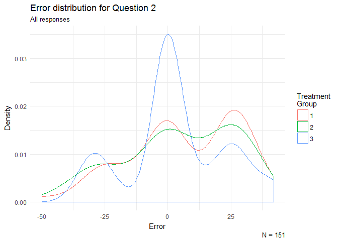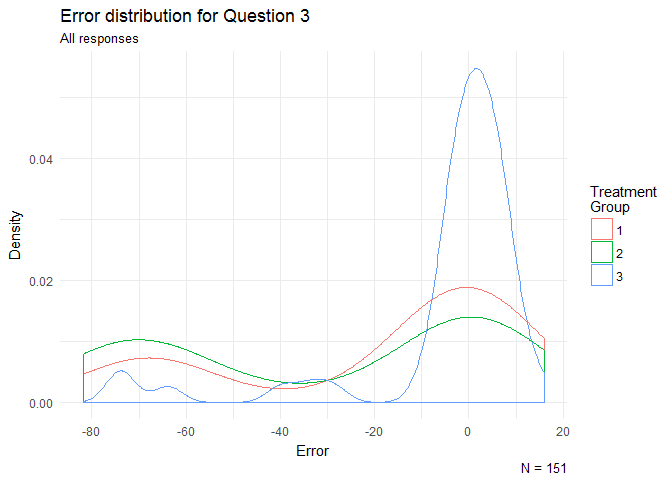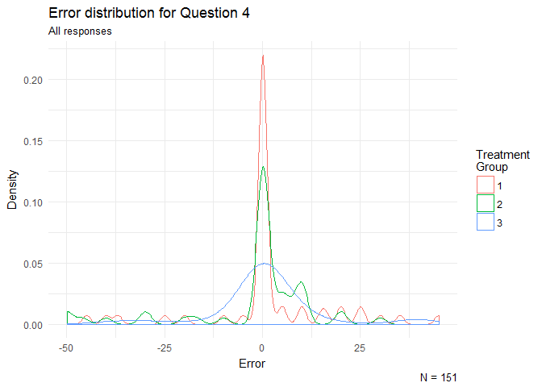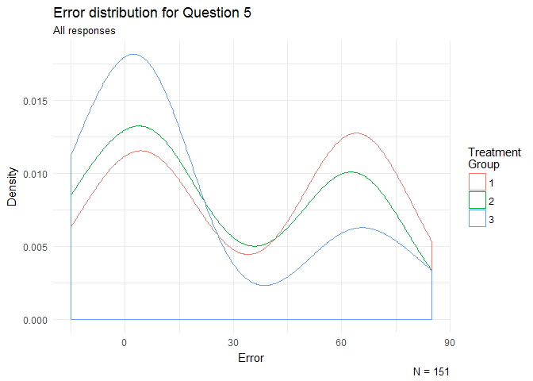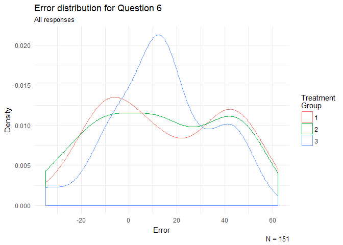

Limitations and counter-arguments
---------------------------------

As previously discussed, the experimental design has some important flaws. First, the wording and presentation were evidently unclear to many of the participants. Almost half of all participants provided responses that were unsuable in the end. Since I did not limit the participant pool by any selection criteria, it is likely that poor English reading comprehension was an issue. This could have been addressed by limiting the pool of eligible workers to those located in the US and with a certain level of education. However, the wording of the questions itself was less than clear. A few native English-speakers contacted me by e-mail, stating that they had minsunderstood the questions. In addition, to make the expectations of the experiment abundantly clear, I could have included a training HIT or some examples at the beginning of the HIT.

Secondly, the arguments involved in hypotheses 2 and 3 are not mutually exclusive. Thus, the methodology used cannot fully address all three hypotheses. For example, selectively colored bar charts where only the relevant parts were colored and the rest uncolored, by themselves, do not fully control for the attention-grabbing effect of color that hypothesis 2 is concerned with. To extend the analysis, it may be helpful to use charts using selective coloring for relevant parts in addition to using color elsewhere in the chart, and also to experiment with different colors and forms of shading than what was used in this study.

### Citations

Cleveland, William S., and Robert McGill. 1984. "Graphical Perception: Theory, Experimentation, and Application to the Development of Graphical Methods." *Journal of the American Statistical Association* 79 (387): 531-54.

Heer, Jeffrey, and Michael Bostock. 2010. "Crowdsourcing Graphical Perception: Using Mechanical Turk to Assess Visualization Design." *CHI*, 203-12.
